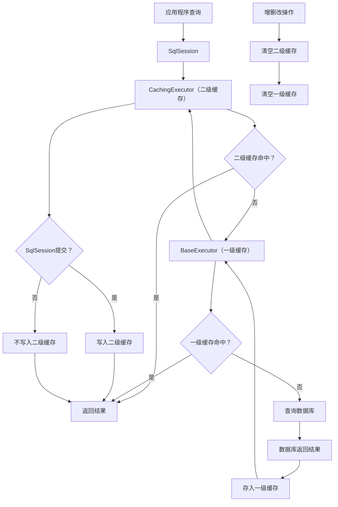

在数据访问层（DAO）性能优化体系中，缓存是性价比最高的优化手段之一。对于高频查询场景，通过复用已查询结果减少数据库交互次数，能直接降低数据库IO压力、提升接口响应速度。MyBatis作为主流ORM框架，内置了完善的两级缓存体系——一级缓存（本地缓存）和二级缓存（全局缓存），二者协同工作又各司其职。

## 一、MyBatis缓存体系总览
MyBatis缓存设计的核心思路是“分层缓存+优先级查询”，即查询时先查高层缓存（二级缓存），再查低层缓存（一级缓存），最后查数据库，确保缓存的高效复用。

### 1.1 缓存的核心价值
- **降低数据库压力**：减少高频查询的数据库IO次数，避免数据库因大量查询请求过载；
- **提升响应速度**：内存读写速度远快于磁盘IO，缓存命中时能直接返回结果，大幅缩短接口响应时间；
- **减少网络传输**：分布式场景下，避免频繁从数据库服务器传输数据到应用服务器。

### 1.2 两级缓存核心对比
MyBatis一级缓存和二级缓存在作用域、共享性、默认状态等维度差异显著，具体对比如下：

| 对比维度 | 一级缓存（本地缓存） | 二级缓存（全局缓存） |
|----------|----------------------|----------------------|
| 作用域 | SqlSession（会话）级别，单个SqlSession私有 | Mapper（命名空间）级别，跨SqlSession共享 |
| 默认状态 | 默认开启，无需任何配置 | 默认关闭，需手动开启（全局+Mapper级） |
| 存储载体 | BaseExecutor内置的PerpetualCache（基于HashMap） | Mapper对应的Cache对象（默认PerpetualCache，可自定义） |
| 缓存Key生成 | MappedStatement ID + SQL语句 + 参数 + 分页信息 + 环境信息 | 与一级缓存Key生成规则一致（确保同一查询的唯一性） |
| 生命周期 | 随SqlSession创建而初始化，随SqlSession关闭/提交/回滚而清空 | 随应用启动而初始化，随应用停止而销毁（或手动清空） |
| 数据一致性保障 | SqlSession内增删改操作会清空缓存，避免会话内数据不一致 | 同一命名空间内增删改操作会清空缓存，跨命名空间需手动处理 |

### 1.3 核心缓存组件
MyBatis缓存功能基于一套清晰的接口体系实现，核心组件如下：
- **Cache接口**：缓存的顶级接口，定义了缓存的核心操作（put、get、remove、clear、getSize等），所有缓存实现类都需实现此接口；
- **PerpetualCache**：默认的缓存实现类，底层基于HashMap存储缓存数据，是最基础的缓存载体，无过期淘汰机制；
- **Cache装饰器**：MyBatis通过装饰器模式增强PerpetualCache的功能，如LRUCache（最近最少使用淘汰）、FIFOCache（先进先出淘汰）、SoftCache（软引用缓存，内存不足时回收）等；
- **BaseExecutor**：一级缓存的核心执行器（SimpleExecutor、ReuseExecutor、BatchExecutor的父类），内置一级缓存容器，负责一级缓存的查询与管理；
- **CachingExecutor**：二级缓存的核心执行器，通过装饰BaseExecutor实现，拦截查询请求并处理二级缓存的查询与写入；
- **CacheKey**：缓存的唯一标识，由查询相关的核心信息（MappedStatement ID、SQL、参数等）生成，确保同一查询的缓存Key唯一。

## 二、一级缓存（本地缓存）：SqlSession的私有缓存
一级缓存是MyBatis的默认缓存，作用域限制在单个SqlSession内，不同SqlSession的一级缓存相互隔离。由于无需额外配置，开发中常被默认使用，但也容易因不了解其原理导致数据一致性问题。

### 2.1 一级缓存的核心特性
- **会话私有**：每个SqlSession都会创建独立的一级缓存容器， SqlSessionA的缓存数据无法被SqlSessionB访问；
- **自动开启**：无需在配置文件或Mapper中添加任何配置，创建SqlSession后自动启用；
- **自动清空**：当执行增删改操作（insert/update/delete）、调用SqlSession.commit()/rollback()/close()时，一级缓存会被自动清空，避免缓存与数据库数据不一致；
- **无过期机制**：默认使用PerpetualCache，缓存数据会一直存在直到SqlSession生命周期结束，无自动淘汰机制。

### 2.2 一级缓存的工作原理
一级缓存的核心逻辑封装在BaseExecutor中，其查询流程可概括为以下6步：
1. 应用程序调用SqlSession的selectOne/selectList等查询方法；
2. SqlSession将查询请求转发给BaseExecutor；
3. BaseExecutor根据查询信息（MappedStatement ID、SQL语句、参数、分页信息等）生成CacheKey；
4. BaseExecutor通过CacheKey查询一级缓存：
   - 若缓存命中，直接返回缓存中的结果，无需访问数据库；
   - 若缓存未命中，执行后续数据库查询流程。
5. BaseExecutor调用数据库执行SQL，获取查询结果；
6. 将查询结果存入一级缓存，然后返回给应用程序。

关键说明：一级缓存的清空触发场景——① 执行增删改操作（MyBatis认为增删改会修改数据，必须清空缓存）；② 调用SqlSession.commit()（提交事务，可能伴随数据修改）；③ 调用SqlSession.rollback()（回滚事务，数据状态回退）；④ 调用SqlSession.close()（关闭会话，释放资源）。

### 2.3 一级缓存核心源码拆解
一级缓存的核心逻辑集中在BaseExecutor的query方法中，我们通过源码逐步拆解其工作流程：
```java
public abstract class BaseExecutor implements Executor {
    // 一级缓存容器：PerpetualCache是默认实现，底层基于HashMap
    protected PerpetualCache localCache;
    // 存储过程输出参数缓存（辅助缓存）
    protected PerpetualCache localOutputParameterCache;

    @Override
    public <E> List<E> query(MappedStatement ms, Object parameter, RowBounds rowBounds, ResultHandler resultHandler) throws SQLException {
        // 1. 生成BoundSql对象：封装SQL语句、参数、参数映射等核心查询信息
        BoundSql boundSql = ms.getBoundSql(parameter);
        // 2. 生成缓存Key：确保同一查询的Key唯一
        CacheKey key = createCacheKey(ms, parameter, rowBounds, boundSql);
        // 3. 调用重载的query方法，传入CacheKey处理缓存逻辑
        return query(ms, parameter, rowBounds, resultHandler, key, boundSql);
    }

    @SuppressWarnings("unchecked")
    public <E> List<E> query(MappedStatement ms, Object parameter, RowBounds rowBounds, ResultHandler resultHandler, CacheKey key, BoundSql boundSql) throws SQLException {
        List<E> list;
        try {
            // 4. 先查询一级缓存：根据CacheKey从localCache中获取结果
            list = resultHandler == null ? (List<E>) localCache.getObject(key) : null;
            if (list != null) {
                // 5. 缓存命中：处理存储过程的输出参数（若为存储过程查询）
                handleLocallyCachedOutputParameters(ms, key, parameter, boundSql);
            } else {
                // 6. 缓存未命中：查询数据库，并将结果存入一级缓存
                list = queryFromDatabase(ms, parameter, rowBounds, resultHandler, key, boundSql);
            }
        } catch (SQLException e) {
            // 异常处理：中断查询，清空部分缓存
            closeStatement();
            throw e;
        } finally {
            // 重置本地变量
            configuration.getLocalCacheScope() == LocalCacheScope.STATEMENT && clearLocalCache();
        }
        return list;
    }

    // 从数据库查询数据，并写入一级缓存
    private <E> List<E> queryFromDatabase(MappedStatement ms, Object parameter, RowBounds rowBounds, ResultHandler resultHandler, CacheKey key, BoundSql boundSql) throws SQLException {
        List<E> list;
        // 7. 先向缓存中放入占位符（EXECUTION_PLACEHOLDER）：避免循环查询（如查询结果依赖自身）
        localCache.putObject(key, EXECUTION_PLACEHOLDER);
        try {
            // 8. 执行数据库查询：由子类实现（如SimpleExecutor.doQuery）
            list = doQuery(ms, parameter, rowBounds, resultHandler, boundSql);
        } finally {
            // 9. 移除占位符：查询完成后删除占位符，避免影响后续查询
            localCache.removeObject(key);
        }
        // 10. 将查询结果存入一级缓存
        localCache.putObject(key, list);
        // 11. 若为存储过程查询，缓存输出参数
        if (ms.getStatementType() == StatementType.CALLABLE) {
            localOutputParameterCache.putObject(key, parameter);
        }
        return list;
    }

    // 增删改操作会触发一级缓存清空
    @Override
    public int update(MappedStatement ms, Object parameter) throws SQLException {
        try {
            // 12. 清空一级缓存：确保数据一致性
            clearLocalCache();
            // 13. 执行增删改操作（子类实现）
            return doUpdate(ms, parameter);
        } finally {
            closeStatement();
        }
    }

    // 清空一级缓存
    @Override
    public void clearLocalCache() {
        if (!localCache.isEmpty()) {
            localCache.clear();
        }
        if (!localOutputParameterCache.isEmpty()) {
            localOutputParameterCache.clear();
        }
    }
}
```

源码关键总结：
- 一级缓存的核心是localCache（PerpetualCache实例），本质是HashMap；
- CacheKey的生成是一级缓存的核心，createCacheKey方法会整合MappedStatement ID、SQL语句、参数、分页信息、环境信息等，确保同一查询的Key唯一；
- 增删改操作（update方法）会先调用clearLocalCache清空一级缓存，这是保障会话内数据一致性的关键；
- 查询时会先放入占位符，避免循环查询导致的死锁或数据异常。

### 2.4 一级缓存实践验证
通过简单的代码示例，验证一级缓存的存在及自动清空机制：
```java
public class FirstLevelCacheTest {
    private SqlSessionFactory sqlSessionFactory;

    @Before
    public void init() throws IOException {
        // 初始化SqlSessionFactory
        String resource = "mybatis-config.xml";
        InputStream inputStream = Resources.getResourceAsStream(resource);
        sqlSessionFactory = new SqlSessionFactoryBuilder().build(inputStream);
    }

    // 验证一级缓存命中：同一SqlSession内多次查询同一数据，只执行一次SQL
    @Test
    public void testFirstLevelCacheHit() {
        try (SqlSession sqlSession = sqlSessionFactory.openSession()) {
            UserMapper userMapper = sqlSession.getMapper(UserMapper.class);
            // 第一次查询：缓存未命中，执行SQL
            User user1 = userMapper.selectUserById(1L);
            System.out.println("第一次查询结果：" + user1);

            // 第二次查询：同一SqlSession，同一查询条件，缓存命中，不执行SQL
            User user2 = userMapper.selectUserById(1L);
            System.out.println("第二次查询结果：" + user2);

            // 验证两个对象是否为同一实例（缓存复用）
            System.out.println("两次查询结果是否为同一对象：" + (user1 == user2)); // true
        }
    }

    // 验证增删改操作清空一级缓存
    @Test
    public void testUpdateClearFirstLevelCache() {
        try (SqlSession sqlSession = sqlSessionFactory.openSession()) {
            UserMapper userMapper = sqlSession.getMapper(UserMapper.class);
            // 第一次查询：缓存未命中，执行SQL
            User user1 = userMapper.selectUserById(1L);
            System.out.println("第一次查询结果：" + user1);

            // 执行更新操作：修改用户信息
            User user = new User();
            user.setId(1L);
            user.setName("更新后的名字");
            userMapper.updateUser(user);
            sqlSession.commit(); // 提交事务（也会清空缓存）

            // 第二次查询：缓存已被清空，重新执行SQL
            User user2 = userMapper.selectUserById(1L);
            System.out.println("第二次查询结果：" + user2);

            // 验证两个对象是否为同一实例（缓存已清空，重新查询）
            System.out.println("两次查询结果是否为同一对象：" + (user1 == user2)); // false
        }
    }
}
```

执行结果分析：
- testFirstLevelCacheHit：两次查询同一用户，控制台只打印一次SQL执行日志，且两个User对象是同一实例，说明一级缓存生效；
- testUpdateClearFirstLevelCache：更新操作后，第二次查询重新执行SQL，两个User对象不是同一实例，说明增删改操作清空了一级缓存。

## 三、二级缓存（全局缓存）：跨SqlSession的共享缓存
二级缓存是作用于Mapper命名空间的全局缓存，可跨多个SqlSession共享。相比一级缓存，二级缓存的复用范围更广，适合高频查询、数据变更频率低的场景（如字典表、配置表）。但由于默认关闭，需要手动配置开启。

### 3.1 二级缓存的核心特性
- **全局共享**：作用域为Mapper命名空间（如com.example.mapper.UserMapper），同一命名空间下的所有SqlSession可共享缓存数据；
- **手动开启**：需要在MyBatis全局配置文件中开启二级缓存总开关，再在具体Mapper中开启缓存；
- **支持自定义实现**：默认使用PerpetualCache，可通过配置替换为Redis、Ehcache等分布式缓存（适合集群环境）；
- **事务性写入**：二级缓存的写入时机是SqlSession提交时，未提交的事务数据不会写入二级缓存，避免脏数据共享；
- **命名空间隔离**：不同Mapper命名空间的缓存相互隔离，UserMapper的缓存数据不会被OrderMapper访问；
- **增删改清空缓存**：同一命名空间内的增删改操作，会清空当前命名空间的二级缓存。

### 3.2 二级缓存的开启与配置
二级缓存需要“全局开启+Mapper开启”两步配置，具体如下：

#### 3.2.1 全局配置开启二级缓存
在MyBatis核心配置文件（mybatis-config.xml）中开启二级缓存总开关（默认值为true，可省略，但显式配置更清晰）：
```xml
<configuration>
    <!-- 开启二级缓存总开关 -->
    <settings>
        <setting name="cacheEnabled" value="true"/>
    </settings>
</configuration>
```

#### 3.2.2 Mapper级开启二级缓存
在需要使用二级缓存的Mapper.xml中添加`<cache>`标签，或在Mapper接口上添加@CacheNamespace注解：

方式1：Mapper.xml中配置`<cache>`标签
```xml
<!-- UserMapper.xml -->
<mapper namespace="com.example.mapper.UserMapper">
    <!-- 开启二级缓存，使用默认配置（PerpetualCache+LRU淘汰） -->
    <cache/>

    <!-- 具体SQL语句 -->
    <select id="selectUserById" resultType="com.example.entity.User">
        SELECT id, name, age FROM user WHERE id = #{id}
    </select>
</mapper>
```

方式2：Mapper接口上添加@CacheNamespace注解
```java
// UserMapper.java
@CacheNamespace(implementation = PerpetualCache.class, eviction = LruCache.class)
public interface UserMapper {
    User selectUserById(Long id);
}
```

补充：`<cache>`标签的常用属性（自定义缓存行为）：
- `eviction`：缓存淘汰策略，默认LRU（最近最少使用），可选值：LRU、FIFO（先进先出）、SOFT（软引用）、WEAK（弱引用）；
- `flushInterval`：缓存刷新间隔（毫秒），默认无间隔（永不过期）；
- `size`：缓存最大容量（默认1024），超过容量后触发淘汰策略；
- `readOnly`：是否只读（默认false），true表示缓存返回数据的只读引用，性能更高；false表示返回数据副本，避免修改缓存数据影响其他查询；
- `type`：自定义缓存实现类（如RedisCache）的全类名。

### 3.3 二级缓存的工作原理
二级缓存的核心逻辑封装在CachingExecutor中，CachingExecutor是BaseExecutor的装饰器，通过拦截查询请求实现二级缓存的管理。其工作流程需结合SqlSession的生命周期，具体如下：
1. 应用程序调用SqlSession的查询方法，SqlSession将请求转发给CachingExecutor；
2. CachingExecutor生成当前查询的CacheKey（与一级缓存Key生成规则一致）；
3. CachingExecutor查询当前Mapper命名空间对应的二级缓存：
   - 若二级缓存命中，直接返回缓存结果，无需访问一级缓存和数据库；
   - 若二级缓存未命中，将请求转发给BaseExecutor（一级缓存执行器）；
4. BaseExecutor执行一级缓存查询流程（与前文一致）：
   - 若一级缓存命中，返回结果给CachingExecutor；
   - 若一级缓存未命中，查询数据库，将结果存入一级缓存后返回给CachingExecutor；
5. CachingExecutor在SqlSession提交时，将一级缓存中的结果写入二级缓存（注意：未提交的事务数据不会写入二级缓存）；
6. 若执行同一命名空间内的增删改操作，CachingExecutor会清空当前命名空间的二级缓存，确保数据一致性。

关键说明：二级缓存的写入时机是“SqlSession提交时”，而非查询完成时。这是为了避免事务未提交时，将未确认的数据写入二级缓存，导致其他SqlSession获取脏数据。

### 3.4 二级缓存核心源码拆解
二级缓存的核心逻辑集中在CachingExecutor的query和commit方法中，我们通过源码拆解其工作流程：
```java
public class CachingExecutor implements Executor {
    // 被装饰的Executor（实际是BaseExecutor及其子类）
    private final Executor delegate;
    // 二级缓存管理器：维护所有Mapper命名空间的缓存
    private final TransactionalCacheManager tcm = new TransactionalCacheManager();

    @Override
    public <E> List<E> query(MappedStatement ms, Object parameter, RowBounds rowBounds, ResultHandler resultHandler) throws SQLException {
        // 1. 生成BoundSql对象
        BoundSql boundSql = ms.getBoundSql(parameter);
        // 2. 生成CacheKey（与一级缓存Key一致）
        CacheKey key = createCacheKey(ms, parameter, rowBounds, boundSql);
        // 3. 调用重载的query方法处理二级缓存
        return query(ms, parameter, rowBounds, resultHandler, key, boundSql);
    }

    @SuppressWarnings("unchecked")
    public <E> List<E> query(MappedStatement ms, Object parameter, RowBounds rowBounds, ResultHandler resultHandler, CacheKey key, BoundSql boundSql) throws SQLException {
        // 4. 获取当前Mapper命名空间对应的二级缓存（从MappedStatement中获取）
        Cache cache = ms.getCache();
        if (cache != null) {
            // 5. 检查是否需要刷新缓存（根据flushInterval配置）
            flushCacheIfRequired(ms);
            if (ms.isUseCache() && resultHandler == null) {
                // 6. 处理存储过程输出参数缓存
                ensureNoOutParams(ms, parameter, boundSql);
                // 7. 从二级缓存中获取数据
                List<E> list = (List<E>) tcm.getObject(cache, key);
                if (list == null) {
                    // 8. 二级缓存未命中：委托给BaseExecutor查询（一级缓存+数据库）
                    list = delegate.query(ms, parameter, rowBounds, resultHandler, key, boundSql);
                    // 9. 将查询结果存入二级缓存（此时只是存入临时容器，未真正写入）
                    tcm.putObject(cache, key, list); 
                }
                return list;
            }
        }
        // 10. 若未开启二级缓存，直接委托给BaseExecutor查询
        return delegate.query(ms, parameter, rowBounds, resultHandler, key, boundSql);
    }

    // 提交事务：将临时缓存中的数据写入二级缓存
    @Override
    public void commit(boolean required) throws SQLException {
        // 11. 委托BaseExecutor提交事务
        delegate.commit(required);
        // 12. 将临时缓存中的数据写入二级缓存（核心：二级缓存的写入时机）
        tcm.commit();
    }

    // 增删改操作会清空二级缓存
    @Override
    public int update(MappedStatement ms, Object parameter) throws SQLException {
        // 13. 刷新缓存（清空当前命名空间的二级缓存）
        flushCacheIfRequired(ms);
        // 14. 委托BaseExecutor执行增删改操作
        return delegate.update(ms, parameter);
    }

    // 检查是否需要刷新缓存（增删改操作或select标签配置flushCache="true"时）
    private void flushCacheIfRequired(MappedStatement ms) {
        Cache cache = ms.getCache();
        if (cache != null && ms.isFlushCacheRequired()) {
            // 15. 清空二级缓存
            tcm.clear(cache);
        }
    }
}
```

源码关键总结：
- CachingExecutor通过装饰模式增强BaseExecutor，核心是添加了二级缓存的查询与写入逻辑；
- 二级缓存的实际管理由TransactionalCacheManager负责，其内部通过TransactionalCache（事务性缓存）实现“提交时写入”的逻辑——查询结果先存入临时容器，事务提交后才真正写入二级缓存；
- 增删改操作会触发flushCacheIfRequired方法，清空当前命名空间的二级缓存；此外，若select标签配置flushCache="true"，查询时也会清空二级缓存；
- 只有当MappedStatement的useCache属性为true（默认true）时，才会使用二级缓存，可通过select标签的useCache="false"禁用当前查询的二级缓存。

### 3.5 二级缓存实践验证
通过代码示例验证二级缓存的跨SqlSession共享特性：
```java
public class SecondLevelCacheTest {
    private SqlSessionFactory sqlSessionFactory;

    @Before
    public void init() throws IOException {
        String resource = "mybatis-config.xml";
        InputStream inputStream = Resources.getResourceAsStream(resource);
        sqlSessionFactory = new SqlSessionFactoryBuilder().build(inputStream);
    }

    // 验证二级缓存跨SqlSession共享
    @Test
    public void testSecondLevelCacheShare() {
        // 第一个SqlSession：查询数据，提交事务后写入二级缓存
        try (SqlSession sqlSession1 = sqlSessionFactory.openSession()) {
            UserMapper userMapper1 = sqlSession1.getMapper(UserMapper.class);
            User user1 = userMapper1.selectUserById(1L);
            System.out.println("第一个SqlSession查询结果：" + user1);
            sqlSession1.commit(); // 提交事务，将数据写入二级缓存
        }

        // 第二个SqlSession：同一查询条件，从二级缓存获取数据，不执行SQL
        try (SqlSession sqlSession2 = sqlSessionFactory.openSession()) {
            UserMapper userMapper2 = sqlSession2.getMapper(UserMapper.class);
            User user2 = userMapper2.selectUserById(1L);
            System.out.println("第二个SqlSession查询结果：" + user2);
            // 验证两个SqlSession的查询结果是否为同一实例（二级缓存复用）
            // 注意：若二级缓存readOnly="false"，返回的是副本，此处为false；readOnly="true"时为true
            System.out.println("两个SqlSession查询结果是否为同一对象：" + (user1 == user2)); // false（默认readOnly=false）
        }
    }

    // 验证增删改操作清空二级缓存
    @Test
    public void testUpdateClearSecondLevelCache() {
        // 第一个SqlSession：查询并提交，写入二级缓存
        try (SqlSession sqlSession1 = sqlSessionFactory.openSession()) {
            UserMapper userMapper1 = sqlSession1.getMapper(UserMapper.class);
            User user1 = userMapper1.selectUserById(1L);
            sqlSession1.commit();
        }

        // 第二个SqlSession：执行更新操作，清空二级缓存
        try (SqlSession sqlSession2 = sqlSessionFactory.openSession()) {
            UserMapper userMapper2 = sqlSession2.getMapper(UserMapper.class);
            User user = new User();
            user.setId(1L);
            user.setName("二级缓存测试");
            userMapper2.updateUser(user);
            sqlSession2.commit(); // 提交事务，清空二级缓存
        }

        // 第三个SqlSession：查询，二级缓存已清空，重新执行SQL
        try (SqlSession sqlSession3 = sqlSessionFactory.openSession()) {
            UserMapper userMapper3 = sqlSession3.getMapper(UserMapper.class);
            User user3 = userMapper3.selectUserById(1L);
            System.out.println("更新后查询结果：" + user3); // 新数据，重新执行SQL
        }
    }
}
```

执行结果分析：
- testSecondLevelCacheShare：第一个SqlSession提交后，第二个SqlSession查询同一数据时不执行SQL，说明二级缓存生效且跨SqlSession共享；默认readOnly=false时，返回的是数据副本，因此两个User对象不是同一实例；
- testUpdateClearSecondLevelCache：第二个SqlSession执行更新并提交后，第三个SqlSession查询重新执行SQL，说明增删改操作清空了二级缓存。

## 四、MyBatis缓存协同工作流程
当二级缓存开启时，MyBatis的缓存查询遵循“二级缓存→一级缓存→数据库”的优先级，写入遵循“数据库→一级缓存→（事务提交）二级缓存”的顺序。完整的协同流程如下：
1. 应用程序发起查询请求，通过SqlSession调用Mapper方法；
2. SqlSession将请求转发给CachingExecutor（二级缓存执行器）；
3. CachingExecutor生成CacheKey，查询当前Mapper的二级缓存：
   - 若二级缓存命中，直接返回结果给应用程序；
   - 若二级缓存未命中，将请求转发给BaseExecutor（一级缓存执行器）；
4. BaseExecutor通过CacheKey查询一级缓存：
   - 若一级缓存命中，返回结果给CachingExecutor，再由CachingExecutor返回给应用程序；
   - 若一级缓存未命中，BaseExecutor执行SQL查询数据库；
5. 数据库返回查询结果给BaseExecutor；
6. BaseExecutor将结果存入一级缓存；
7. BaseExecutor将结果返回给CachingExecutor；
8. 应用程序调用SqlSession.commit()提交事务；
9. CachingExecutor通过TransactionalCacheManager将一级缓存中的结果写入二级缓存；
10. 若执行增删改操作：
    - CachingExecutor清空当前Mapper的二级缓存；
    - BaseExecutor清空当前SqlSession的一级缓存。

流程图解：


## 五、常见问题与最佳实践
在使用MyBatis缓存时，若不注意数据一致性、缓存配置等问题，容易导致查询结果异常。以下是开发中常见的问题及对应的最佳实践：

### 5.1 常见问题
#### 5.1.1 一级缓存导致的脏读问题
问题场景：同一SqlSession内，先查询数据，之后数据库数据被其他线程修改，但当前SqlSession再次查询时仍获取一级缓存中的旧数据，导致脏读。

原因：一级缓存是会话私有，未感知数据库的外部修改。

解决方案：① 避免长时间持有SqlSession（使用try-with-resources自动关闭）；② 对高频修改的数据，在select标签中配置flushCache="true"（查询前清空一级缓存）；③ 手动调用SqlSession.clearCache()清空一级缓存。

#### 5.1.2 二级缓存的跨命名空间数据一致性问题
问题场景：UserMapper和OrderMapper存在关联关系（Order关联User），UserMapper的二级缓存中存储了用户数据，当OrderMapper执行增删改操作修改了用户相关数据时，无法清空UserMapper的二级缓存，导致UserMapper查询到脏数据。

原因：二级缓存是命名空间隔离的，不同命名空间的增删改操作无法清空其他命名空间的缓存。

解决方案：① 使用`<cache-ref>`标签共享缓存（多个Mapper共用一个命名空间的缓存）；② 手动清空相关命名空间的二级缓存；③ 避免在关联查询场景中过度依赖二级缓存。

#### 5.1.3 二级缓存未命中的常见原因
问题场景：已开启二级缓存，但查询仍未命中。

常见原因：① 未提交SqlSession（二级缓存需提交后才写入）；② 查询条件不同（CacheKey不同）；③ select标签配置useCache="false"；④ 增删改操作清空了缓存；⑤ 缓存过期或容量满被淘汰。

### 5.2 最佳实践
#### 5.2.1 一级缓存使用建议
- 优先使用try-with-resources语法自动关闭SqlSession，避免长时间持有导致脏读；
- 高频修改的数据，在select标签中添加flushCache="true"，确保每次查询都获取最新数据；
- 避免在事务中长时间执行查询操作，防止一级缓存堆积大量数据。

#### 5.2.2 二级缓存使用建议
- 只对“高频查询、低频修改”的数据开启二级缓存（如字典表、配置表）；
- 集群环境下，使用分布式缓存（如Redis）替代默认的本地二级缓存，避免集群节点间缓存不一致；
- 合理配置缓存淘汰策略（如LRU）和容量，避免缓存溢出；
- 关联查询场景中，使用`<cache-ref>`共享缓存，或避免使用二级缓存；
- 对不需要缓存的查询，配置useCache="false"（如实时性要求高的查询）。

#### 5.2.3 分布式缓存整合示例（Redis）
MyBatis支持通过自定义Cache实现整合Redis，步骤如下：

1. 引入Redis依赖：
```xml
<dependency>
    <groupId>redis.clients</groupId>
    <artifactId>jedis</artifactId>
    <version>3.8.0</version>
</dependency>
```

2. 实现Cache接口（RedisCache）：
```java
public class RedisCache implements Cache {
    private final String id; // 缓存ID（Mapper命名空间）
    private Jedis jedis; // Redis客户端
    private static final String PREFIX = "mybatis:cache:";
    private static final int EXPIRE_TIME = 3600; // 缓存过期时间（秒）

    // 必须实现带id参数的构造方法（MyBatis会自动传入Mapper命名空间）
    public RedisCache(String id) {
        this.id = id;
        // 初始化Redis连接（实际开发中建议使用连接池）
        jedis = new Jedis("localhost", 6379);
    }

    @Override
    public String getId() {
        return id;
    }

    @Override
    public void putObject(Object key, Object value) {
        // 序列化Key和Value，存入Redis
        String redisKey = PREFIX + key.toString();
        jedis.set(redisKey.getBytes(), SerializationUtils.serialize(value));
        jedis.expire(redisKey.getBytes(), EXPIRE_TIME);
    }

    @Override
    public Object getObject(Object key) {
        // 从Redis获取数据，反序列化后返回
        String redisKey = PREFIX + key.toString();
        byte[] bytes = jedis.get(redisKey.getBytes());
        return bytes != null ? SerializationUtils.deserialize(bytes) : null;
    }

    @Override
    public Object removeObject(Object key) {
        // 移除缓存
        String redisKey = PREFIX + key.toString();
        return jedis.del(redisKey.getBytes()) > 0;
    }

    @Override
    public void clear() {
        // 清空当前命名空间的缓存（通过前缀匹配删除）
        Set<byte[]> keys = jedis.keys((PREFIX + "*").getBytes());
        for (byte[] key : keys) {
            jedis.del(key);
        }
    }

    @Override
    public int getSize() {
        // 获取缓存数量（通过前缀匹配统计）
        Set<byte[]> keys = jedis.keys((PREFIX + "*").getBytes());
        return keys.size();
    }
}
```

3. 在Mapper中配置使用RedisCache：
```xml
<mapper namespace="com.example.mapper.UserMapper">
    <!-- 配置使用自定义的RedisCache -->
    <cache type="com.example.cache.RedisCache" eviction="LRU" size="1000" flushInterval="3600000"/>
</mapper>
```

## 六、总结
MyBatis缓存机制的核心是“两级缓存分层设计”，一级缓存保障会话内的查询效率，二级缓存实现跨会话的缓存共享，二者协同实现高效的数据复用。

核心要点回顾：
- 一级缓存：SqlSession级别，默认开启，自动清空，适合会话内短期复用；
- 二级缓存：Mapper命名空间级别，手动开启，提交时写入，适合全局高频查询数据；
- 缓存优先级：二级缓存 > 一级缓存 > 数据库；
- 数据一致性：增删改操作会清空对应缓存，二级缓存需注意跨命名空间的一致性问题；
- 分布式场景：需整合Redis等分布式缓存，替代默认本地二级缓存。