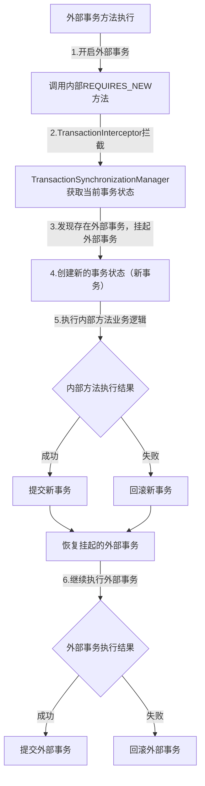

# Spring事务传播机制深度解析：原理、特性与实战

在Spring开发中，事务管理是保障数据一致性的核心手段，而“事务传播机制”则是多事务方法嵌套调用时的核心规则——它决定了嵌套场景下，内部事务如何与外部事务协同工作（是加入外部事务、创建新事务，还是挂起外部事务）。

## 一、核心认知：什么是Spring事务传播？

### 1.1 定义
Spring事务传播机制，指的是**当一个事务方法（被@Transactional注解标记）调用另一个事务方法时，Spring如何管理这两个方法的事务边界**。具体来说，它定义了：
- 内部事务是否需要创建新的事务；
- 内部事务是否需要加入外部事务（即与外部事务共用一个事务）；
- 当外部事务回滚/提交时，对内部事务的影响；
- 当内部事务抛出异常时，对外部事务的影响。

### 1.2 为什么需要事务传播？
实际开发中，事务方法的嵌套调用极为常见，不同业务场景对事务的协同要求不同。例如：
1. **场景1：下单流程**：下单方法（外部事务）调用扣库存方法（内部事务）。要求：下单失败则扣库存必须回滚，扣库存失败则下单也必须回滚（两者共用一个事务）；
2. **场景2：下单记日志**：下单方法（外部事务）调用记录操作日志方法（内部事务）。要求：下单失败时日志不能回滚（日志需要独立保存），日志记录失败不影响下单流程；
3. **场景3：批量数据处理**：批量导入方法（外部事务）调用单条导入方法（内部事务）。要求：单条导入失败时，仅回滚该条数据的导入，不影响其他数据和外部事务。

如果没有灵活的事务传播机制，仅靠“单一事务”无法满足这些复杂场景的需求。Spring的7种事务传播行为，正是为了解决不同嵌套场景下的事务协同问题。

## 二、基础铺垫：Spring事务的核心前提

在深入传播机制前，需先明确Spring事务的几个核心前提，避免后续理解偏差：

### 2.1 事务的核心特性（ACID）
事务的原子性（Atomicity）、一致性（Consistency）、隔离性（Isolation）、持久性（Durability）是传播机制的基础——传播机制的本质是在嵌套场景下保障ACID特性的灵活适配。

### 2.2 声明式事务的基础使用
Spring事务传播机制基于“声明式事务”（@Transactional注解）生效，核心配置如下：
```java
@Transactional(
    propagation = Propagation.REQUIRED, // 事务传播行为（默认REQUIRED）
    isolation = Isolation.DEFAULT,      // 事务隔离级别
    rollbackFor = Exception.class,      // 触发回滚的异常类型
    readOnly = false                    // 是否为只读事务
)
public void businessMethod() {
    // 业务逻辑
}
```
其中，`propagation`属性指定事务传播行为，是本文的核心。

### 2.3 事务的核心边界
Spring事务的边界由“事务管理器”（PlatformTransactionManager）控制：
- 事务开始：进入@Transactional标记的方法时，事务管理器创建事务（开启数据库连接，设置自动提交为false）；
- 事务提交：方法正常执行完成后，事务管理器提交事务（执行commit）；
- 事务回滚：方法抛出异常（且异常符合rollbackFor配置）时，事务管理器回滚事务（执行rollback）。

事务传播机制的核心，就是修改这一“边界规则”在嵌套场景下的表现。

## 三、核心解析：7种Spring事务传播行为

Spring定义了7种事务传播行为，封装在`org.springframework.transaction.annotation.Propagation`枚举类中。我们按“是否依赖外部事务”分为3大类，逐一解析每种传播行为的特性、适用场景和执行逻辑。

### 3.1 第一类：依赖外部事务（默认场景）
此类传播行为的核心特点是：内部事务优先依赖外部事务，只有当外部事务不存在时，才会创建新事务。包含2种传播行为：REQUIRED、SUPPORTS。

#### 3.1.1 REQUIRED（默认传播行为）
- **核心定义**：如果当前存在外部事务，则内部事务加入外部事务（共用一个事务）；如果当前没有外部事务，则创建新的事务。
- **英文释义**：Support a current transaction, create a new one if none exists.
- **执行逻辑**：
  1. 外部方法有事务：内部方法与外部方法共用一个事务，事务的提交/回滚由外部方法控制；
  2. 外部方法无事务：内部方法创建新的独立事务，自己控制提交/回滚。
- **回滚规则**：
  - 内部方法抛出异常（符合回滚规则）：无论外部方法是否捕获，都会导致整个事务回滚；
  - 外部方法抛出异常：内部方法的操作也会随外部事务一起回滚。
- **适用场景**：最常用，适用于“内部事务与外部事务强关联”的场景（如下单扣库存、转账等）。
- **实战示例**：
```java
// 外部方法（有事务）
@Transactional(propagation = Propagation.REQUIRED, rollbackFor = Exception.class)
public void createOrder(Order order) {
    // 1. 保存订单
    orderDao.save(order);
    // 2. 调用内部方法（扣库存）
    stockService.deductStock(order.getProductId(), order.getQuantity());
}

// 内部方法（REQUIRED传播行为）
@Transactional(propagation = Propagation.REQUIRED, rollbackFor = Exception.class)
public void deductStock(Long productId, Integer quantity) {
    Stock stock = stockDao.getById(productId);
    if (stock.getQuantity() < quantity) {
        throw new RuntimeException("库存不足");
    }
    stock.setQuantity(stock.getQuantity() - quantity);
    stockDao.update(stock);
}
```
执行结果分析：
- 扣库存抛出“库存不足”异常：createOrder和deductStock共用一个事务，整个事务回滚，订单不会被保存；
- 保存订单成功，但外部方法后续抛出异常：扣库存操作也会随外部事务回滚，库存恢复原样。

#### 3.1.2 SUPPORTS
- **核心定义**：如果当前存在外部事务，则内部事务加入外部事务；如果当前没有外部事务，则内部事务以“非事务方式”执行（不创建新事务）。
- **英文释义**：Support a current transaction, execute non-transactionally if none exists.
- **执行逻辑**：
  1. 外部有事务：加入外部事务，遵循外部事务的提交/回滚规则；
  2. 外部无事务：以普通方法执行，无事务保障（操作直接提交到数据库）。
- **回滚规则**：
  - 外部有事务时：内部方法的异常会导致整个事务回滚；
  - 外部无事务时：内部方法的异常不会触发回滚（操作已直接提交）。
- **适用场景**：适用于“可选事务”的场景（如查询操作，有事务则加入，无则正常执行）。
- **注意**：SUPPORTS是“被动依赖”外部事务，本身不主动创建事务，需谨慎使用（避免非事务场景下的数据一致性问题）。

### 3.2 第二类：不依赖外部事务（强制创建新事务）
此类传播行为的核心特点是：无论外部是否存在事务，内部事务都会强制创建新的独立事务，与外部事务完全隔离。包含2种传播行为：REQUIRES_NEW、NOT_SUPPORTED。

#### 3.2.1 REQUIRES_NEW
- **核心定义**：无论当前是否存在外部事务，内部事务都会创建一个全新的独立事务；如果外部存在事务，则先将外部事务挂起，待内部事务执行完成后，再恢复外部事务。
- **英文释义**：Create a new transaction, and suspend the current transaction if one exists.
- **执行逻辑**：
  1. 外部有事务：挂起外部事务 → 创建内部新事务 → 内部事务执行完成（提交/回滚） → 恢复外部事务继续执行；
  2. 外部无事务：直接创建新事务，自己控制提交/回滚。
- **回滚规则**：
  - 内部事务的提交/回滚与外部事务完全独立：内部事务失败回滚，不影响外部事务；外部事务失败回滚，也不影响内部事务；
  - 若内部事务抛出异常，外部事务若未捕获，外部事务会回滚；但内部事务的操作已独立提交/回滚，不受影响。
- **适用场景**：适用于“内部事务需要独立存在”的场景（如操作日志、审计记录等，即使主业务失败，日志也需保留）。
- **实战示例**：改造下单记日志场景：
```java
// 外部方法（下单，有事务）
@Transactional(propagation = Propagation.REQUIRED, rollbackFor = Exception.class)
public void createOrder(Order order) {
    try {
        // 1. 保存订单
        orderDao.save(order);
        // 2. 调用内部方法（记日志，REQUIRES_NEW）
        logService.recordOrderLog(order.getId(), "创建订单");
        // 3. 模拟下单失败
        throw new RuntimeException("下单失败");
    } catch (Exception e) {
        throw new RuntimeException("下单异常：" + e.getMessage());
    }
}

// 内部方法（记日志，REQUIRES_NEW）
@Transactional(propagation = Propagation.REQUIRES_NEW, rollbackFor = Exception.class)
public void recordOrderLog(Long orderId, String content) {
    OrderLog log = new OrderLog();
    log.setOrderId(orderId);
    log.setContent(content);
    logDao.save(log);
}
```
执行结果分析：
- 下单方法抛出异常，外部事务回滚，订单不会被保存；
- 记日志方法使用REQUIRES_NEW，创建了独立事务，即使外部事务回滚，日志仍会被成功保存（符合“日志独立保留”的需求）。

#### 3.2.2 NOT_SUPPORTED
- **核心定义**：内部事务以“非事务方式”执行；如果当前存在外部事务，则先将外部事务挂起，待内部方法执行完成后，再恢复外部事务。
- **英文释义**：Execute non-transactionally, suspend the current transaction if one exists.
- **执行逻辑**：
  1. 外部有事务：挂起外部事务 → 内部方法以非事务方式执行（操作直接提交） → 恢复外部事务；
  2. 外部无事务：直接以非事务方式执行。
- **回滚规则**：内部方法的操作不会受任何事务回滚影响（因为本身无事务）；外部事务的回滚也不会影响内部方法的已提交操作。
- **适用场景**：适用于“不需要事务”的场景（如查询大量数据、执行耗时的非核心操作，避免事务长时间占用资源）。
- **注意**：NOT_SUPPORTED会主动挂起外部事务，可能导致外部事务的锁资源长时间占用，需谨慎使用。

### 3.3 第三类：禁止事务（不允许存在事务）
此类传播行为的核心特点是：明确禁止事务环境，若存在外部事务则直接抛出异常。包含2种传播行为：MANDATORY、NEVER。

#### 3.3.1 MANDATORY
- **核心定义**：内部事务必须在外部事务的环境中执行（即当前必须存在外部事务）；如果当前没有外部事务，则直接抛出异常（IllegalTransactionStateException）。
- **英文释义**：Support a current transaction, throw an exception if none exists.
- **执行逻辑**：仅当外部存在事务时，内部事务加入外部事务；否则直接抛异常，不执行任何业务逻辑。
- **适用场景**：适用于“内部方法必须依赖外部事务”的场景（如核心业务的子操作，必须在主事务中执行，不允许独立执行）。
- **实战示例**：
```java
// 内部方法（必须依赖外部事务）
@Transactional(propagation = Propagation.MANDATORY, rollbackFor = Exception.class)
public void deductStock(Long productId, Integer quantity) {
    // 扣库存逻辑
}

// 测试：无外部事务调用
public void testWithoutOuterTransaction() {
    // 调用deductStock，会直接抛出IllegalTransactionStateException
    stockService.deductStock(1L, 2);
}
```

#### 3.3.2 NEVER
- **核心定义**：内部事务必须在“非事务环境”中执行；如果当前存在外部事务，则直接抛出异常（IllegalTransactionStateException）。
- **英文释义**：Execute non-transactionally, throw an exception if a transaction exists.
- **执行逻辑**：仅当外部无事务时，以非事务方式执行；若外部有事务，直接抛异常。
- **适用场景**：适用于“明确禁止事务”的场景（如某些只读操作，不允许在事务中执行，避免事务开销）。

### 3.4 第四类：嵌套事务（依赖外部事务，有独立回滚点）
此类传播行为是Spring对JDBC保存点（Savepoint）的封装，核心特点是：内部事务嵌套在外部事务中，有独立的回滚点，内部事务回滚时不会影响外部事务的整体提交。仅包含1种传播行为：NESTED。

#### 3.4.1 NESTED
- **核心定义**：如果当前存在外部事务，则内部事务作为外部事务的“嵌套事务”执行（创建保存点）；如果当前没有外部事务，则创建新的独立事务（与REQUIRED一致）。
- **英文释义**：Execute within a nested transaction if a current transaction exists, behave like REQUIRED otherwise.
- **执行逻辑**：
  1. 外部有事务：在外部事务中创建保存点 → 内部事务执行 → 内部事务失败时，仅回滚到保存点（不影响外部事务之前的操作）；外部事务失败时，会回滚包括嵌套事务在内的所有操作；
  2. 外部无事务：与REQUIRED一致，创建新事务。
- **回滚规则**：
  - 内部事务回滚：仅回滚自身操作，外部事务可继续执行；
  - 外部事务回滚：内部事务的操作也会被回滚；
  - 内部事务提交：不会立即提交到数据库，需等待外部事务最终提交（嵌套事务依赖外部事务的提交）。
- **与REQUIRES_NEW的核心区别**：

| 特性 | NESTED（嵌套事务） | REQUIRES_NEW（新事务） |
|------|--------------------|------------------------|
| 事务独立性 | 依赖外部事务，无独立事务（共用一个事务） | 完全独立，创建全新事务 |
| 提交时机 | 依赖外部事务提交（自身提交无效） | 自身独立提交，不依赖外部 |
| 回滚范围 | 仅回滚到保存点，不影响外部事务之前操作 | 回滚自身事务，与外部事务无关 |
| 底层实现 | 基于JDBC保存点（Savepoint） | 基于事务挂起（Suspend）机制 |

- **适用场景**：适用于“批量操作”或“部分回滚”的场景（如批量导入数据，单条数据导入失败时，仅回滚该条数据，不影响其他数据和外部事务）。
- **实战示例**：批量导入用户数据：
```java
// 外部方法（批量导入，有事务）
@Transactional(propagation = Propagation.REQUIRED, rollbackFor = Exception.class)
public void batchImportUser(List<User> userList) {
    for (User user : userList) {
        try {
            // 调用内部方法（嵌套事务，NESTED）
            userService.importSingleUser(user);
        } catch (Exception e) {
            // 捕获内部异常，仅记录日志，不影响其他用户导入
            log.error("导入用户{}失败：{}", user.getUsername(), e.getMessage());
        }
    }
}

// 内部方法（单条导入，NESTED）
@Transactional(propagation = Propagation.NESTED, rollbackFor = Exception.class)
public void importSingleUser(User user) {
    if (userDao.existsByUsername(user.getUsername())) {
        throw new RuntimeException("用户名已存在");
    }
    userDao.save(user);
}
```
执行结果分析：
- 若某条用户数据导入失败（用户名已存在），importSingleUser会回滚到保存点，仅该条数据的操作被回滚；
- 外部方法捕获异常后，继续导入其他用户，最终外部事务提交，所有导入成功的用户数据会被保存；
- 若外部方法中途抛出异常（如系统异常），则所有导入操作（包括成功的）都会被回滚。

### 3.5 7种传播行为核心对比表

| 传播行为 | 外部有事务 | 外部无事务 | 核心特点 | 适用场景 |
|----------|------------|------------|----------|----------|
| REQUIRED（默认） | 加入外部事务 | 创建新事务 | 强依赖外部事务，荣辱与共 | 下单扣库存、转账等核心业务 |
| SUPPORTS | 加入外部事务 | 非事务执行 | 可选事务，被动依赖 | 可选事务的查询操作 |
| REQUIRES_NEW | 挂起外部，创建新事务 | 创建新事务 | 完全独立，事务隔离 | 操作日志、审计记录等独立业务 |
| NOT_SUPPORTED | 挂起外部，非事务执行 | 非事务执行 | 禁止事务，主动挂起 | 耗时非核心操作、大量查询 |
| MANDATORY | 加入外部事务 | 抛异常 | 必须依赖外部事务 | 核心业务子操作，不允许独立执行 |
| NEVER | 抛异常 | 非事务执行 | 禁止事务，无事务则执行 | 明确禁止事务的只读操作 |
| NESTED | 嵌套执行（保存点） | 创建新事务 | 依赖外部，独立回滚点 | 批量操作、部分回滚场景 |

## 四、底层原理：Spring事务传播如何实现？

Spring事务传播机制的底层依赖“事务管理器”（PlatformTransactionManager）和“事务同步管理器”（TransactionSynchronizationManager），核心是通过“事务状态”（TransactionStatus）的管理实现传播行为的控制。

### 4.1 核心组件
1. **PlatformTransactionManager**：事务管理器核心接口，定义了getTransaction（获取事务）、commit（提交）、rollback（回滚）方法，不同数据源（JDBC、JPA、MyBatis）有对应的实现（如DataSourceTransactionManager）；
2. **TransactionSynchronizationManager**：线程本地变量（ThreadLocal）的封装，用于存储当前线程的事务状态（是否存在事务、事务保存点等），确保事务传播的线程安全；
3. **TransactionStatus**：封装事务的当前状态（是否为新事务、是否有保存点、是否已完成等），是事务传播的核心状态载体；
4. **TransactionInterceptor**：AOP拦截器，负责在事务方法执行前后拦截，调用事务管理器实现事务的开启、提交、回滚，是传播行为触发的入口。

### 4.2 核心执行流程（以REQUIRES_NEW为例）


### 4.3 关键源码片段（事务状态获取）
TransactionSynchronizationManager通过ThreadLocal存储事务状态，核心源码如下：
```java
public abstract class TransactionSynchronizationManager {
    // 存储当前线程的事务资源（如数据库连接）
    private static final ThreadLocal<Map<Object, Object>> resources = 
        new NamedThreadLocal<>("Transactional resources");
    // 存储当前线程的事务状态
    private static final ThreadLocal<TransactionStatus> transactionStatus = 
        new NamedThreadLocal<>("Transaction status");

    // 获取当前线程的事务资源
    public static Map<Object, Object> getResourceMap() {
        Map<Object, Object> map = resources.get();
        return (map != null ? Collections.unmodifiableMap(map) : Collections.emptyMap());
    }

    // 设置事务状态
    public static void setTransactionStatus(TransactionStatus status) {
        transactionStatus.set(status);
    }

    // ...其他方法
}
```
当执行事务方法时，TransactionInterceptor会通过TransactionSynchronizationManager获取当前线程的事务状态，再根据传播行为决定是创建新事务、加入外部事务还是挂起外部事务。

## 五、实战避坑：事务传播常见问题与解决方案

实际开发中，事务传播机制的使用容易出现各种问题，以下是最常见的3类问题及解决方案：

### 5.1 问题1：嵌套事务不生效（传播行为未触发）
**现象**：内部事务方法的传播行为配置后不生效（如REQUIRES_NEW未创建新事务，NESTED未产生保存点）。

**常见原因**：
1. 内部方法是“自调用”（同一类中方法调用）：A类的a()方法调用本类的b()方法（b()有@Transactional），此时AOP无法拦截，事务注解失效；
2. 事务方法不是public修饰：@Transactional仅对public方法生效，private、protected方法的事务注解会被忽略；
3. 未配置事务管理器：SpringBoot需引入spring-boot-starter-jdbc/data-jpa等依赖，自动配置事务管理器；若自定义数据源，需手动配置TransactionManager；
4. 异常被内部捕获：内部方法抛出的异常被catch捕获，未向上传播，导致事务回滚规则未触发。

**解决方案**：
1. 避免自调用：将内部事务方法抽取到独立的Service类中；
2. 确保事务方法是public修饰；
3. 检查事务管理器配置：SpringBoot可通过@EnableTransactionManagement开启事务管理（默认已开启）；
4. 异常必须向上传播：内部方法抛出的异常不要捕获，或捕获后重新抛出（throw e）。

### 5.2 问题2：回滚范围不符合预期
**现象**：期望内部事务回滚不影响外部事务，但实际外部事务也回滚；或期望外部事务回滚带动内部事务回滚，但实际内部事务未回滚。

**常见原因**：
1. 传播行为选择错误：如需要独立事务却用了REQUIRED，需要嵌套回滚却用了REQUIRES_NEW；
2. rollbackFor配置错误：默认情况下，Spring仅对“未检查异常”（RuntimeException及其子类）回滚，对“已检查异常”（如IOException）不回滚；若内部方法抛出已检查异常，未配置rollbackFor=Exception.class，会导致事务不回滚；
3. NESTED传播行为未生效：NESTED依赖JDBC保存点，需确保数据库支持保存点（如MySQL 5.0+、Oracle均支持），且事务隔离级别不是READ_UNCOMMITTED。

**解决方案**：
1. 根据业务场景选择正确的传播行为（参考3.5节对比表）；
2. 显式配置rollbackFor=Exception.class，确保所有异常都能触发回滚；
3. 使用NESTED时，检查数据库是否支持保存点，调整事务隔离级别为DEFAULT（Spring默认，即数据库默认隔离级别）。

### 5.3 问题3：事务挂起导致的资源泄漏
**现象**：使用REQUIRES_NEW或NOT_SUPPORTED时，出现数据库连接泄漏、锁资源长时间占用。

**常见原因**：
1. 内部事务执行时间过长：挂起外部事务后，内部事务长时间占用数据库连接，导致外部事务的连接资源无法释放；
2. 异常未处理导致挂起的事务未恢复：内部事务抛出异常后，未正确处理，导致挂起的外部事务无法恢复，连接资源泄漏。

**解决方案**：
1. 优化内部事务逻辑，缩短执行时间；
2. 确保异常正确传播和处理：即使内部事务失败，也要保证挂起的外部事务能正常恢复；
3. 避免频繁使用REQUIRES_NEW：仅在必要场景使用，减少事务挂起的开销。

## 六、总结：事务传播的核心选型原则

Spring事务传播机制的核心是“根据业务场景选择合适的传播行为”，以下是核心选型原则，帮你快速决策：
1. **核心业务强关联**：选REQUIRED（默认），确保内部和外部事务荣辱与共；
2. **内部业务需独立**：选REQUIRES_NEW，确保内部事务不受外部影响（如日志）；
3. **批量操作部分回滚**：选NESTED，通过保存点实现局部回滚；
4. **必须依赖外部事务**：选MANDATORY，禁止独立执行；
5. **禁止事务执行**：选NEVER或NOT_SUPPORTED，根据是否允许外部事务存在选择；
6. **可选事务场景**：选SUPPORTS，被动依赖外部事务。

最后需要强调：事务传播机制是Spring事务管理的高级特性，使用时需结合业务场景谨慎选择，避免过度设计。实际开发中，优先使用默认的REQUIRES_NEW，仅在有明确需求时才选择其他传播行为，同时注意规避“自调用”“异常捕获”等常见坑点，确保事务生效且符合预期。